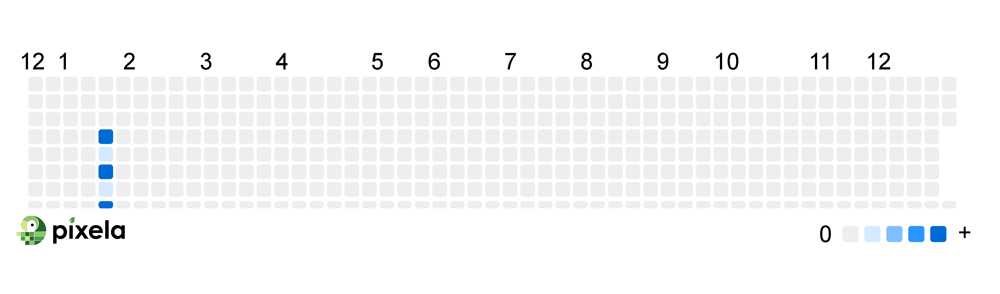

# Pixela Python Tracker



This repository contains Python scripts that interact with the Pixela API, a habit tracking and visualization service. Track your daily coding hours with detailed statistics:

- Total Hours Tracked: 203 hours
- Maximum Daily: 12 hours
- Minimum Daily: 3 hours
- Average: 7.25 hours/day
- Data Points: 28 days of tracking

With this script, you can automate tracking your habits or activities and visualize them in the form of a GitHub-like graph.

## Live Visualization

This project leverages [Pixela](https://pixe.la/) to visually track habits. You can see the live graph here:

https://pixe.la/v1/users/raimonvibe/graphs/coding-hours.html

## Setup & Usage

1. Clone this repository
2. Install dependencies:
   ```bash
   pip install requests
   ```
3. Replace the following placeholders in `main.py` with your information:
   - `<api-token>` - Your Pixela API token
   - `<username>` - Your Pixela username
   - `<graph-id>` - Your graph ID
   - `<timezone>` - Your timezone (e.g., "Asia/Tokyo")

4. Run the script:
   ```bash
   python main.py
   ```

## Dependencies

- Python 3.x
- `requests` library

## Available Functions

The script provides the following functions to interact with the Pixela API:

- `create_user(token, username, agree_terms_of_service, not_minor, thanks_code)`
  - Creates a new Pixela user account

- `create_graph(token, username, graph_id, graph_name, unit, type, color, timezone, is_secret)`
  - Creates a new graph for tracking habits

- `create_pixel(token, username, graph_id, date, quantity, optional_data)`
  - Posts a new data point (pixel) to your graph

- `delete_pixel(token, username, graph_id, date)`
  - Removes a data point from your graph

- `update_pixel(token, username, graph_id, date, quantity)`
  - Modifies an existing data point

Each function maps directly to a Pixela API endpoint. Make sure to replace all placeholder values with your actual data before using these functions.

## Contributing
Contributions are always welcome. Please make sure to update tests as appropriate.

## License
This project is licensed under the MIT License.

https://github.com/raimonvibe/habit-tracker/blob/main/LICENSE.txt

For more details, please refer to the license file in the repository.

